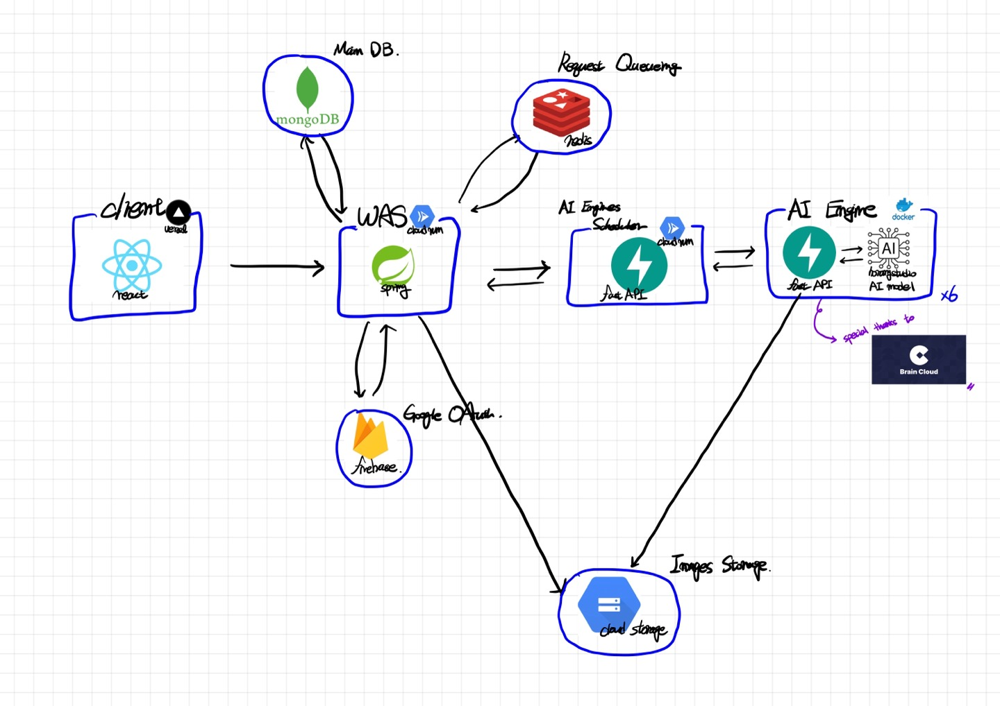
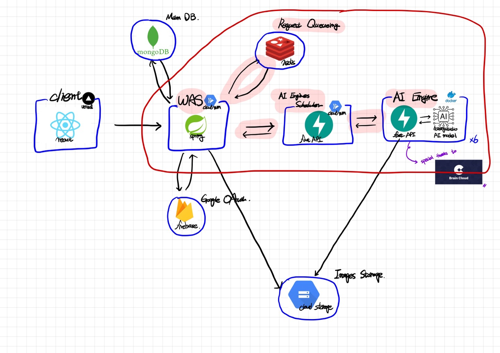
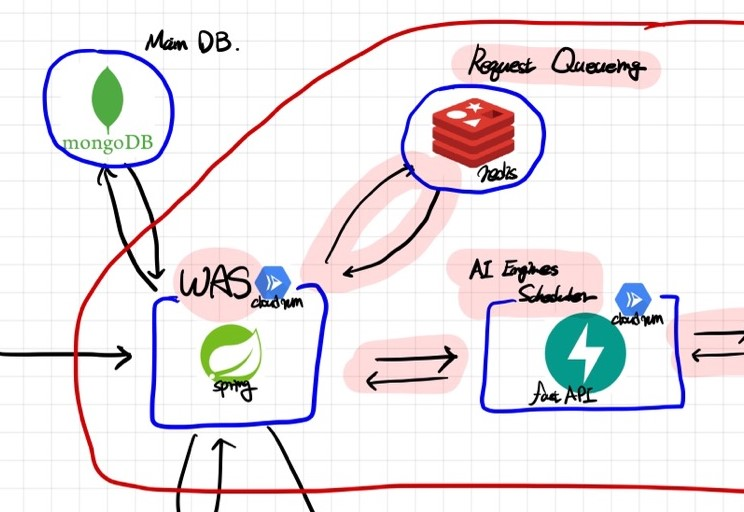
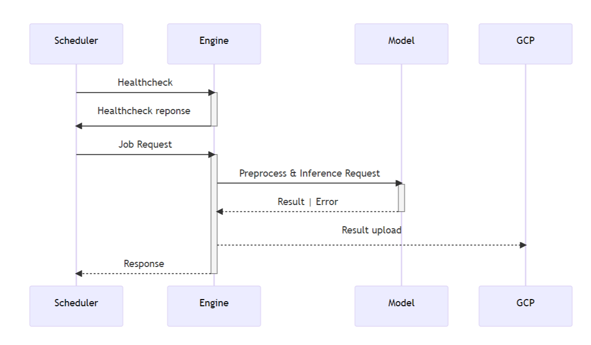

이 글은 AI 모델이 추가된 서비스를 처음으로 개발하고 배포 및 운영까지 해보면서, 특히 신경 썼던 부분을 정리하기 위해 작성되었으며, 해당 파트만을 집중적으로 커버한다.

추후에 GDSC 고려대학교 챕터 내부적으로 AI가 들어가는 이벤트를 진행할 때, 개발자들이 이 글을 참고하며 도움을 받았으면 한다. 혹시라도 다른 분들께서도 이 글을 읽고 도움을 받으신다면, 소소하게 기록을 남기는 나에게는 큰 영광이지 않을까 싶다.

# 호랑이 사진관 아키텍쳐

아래는 전반적인 호랑이 사진관 서버의 아키텍쳐이다.

- 이 글을 빌려 서버를 후원해준 [카카오브레인](https://www.kakaobrain.com/) 측에 다시 한 번 큰 감사를 전한다.

# 호랑이 사진관을 구현하면서 신경 쓴 부분

하이라이트 된 부분이 서비스를 개발하면서 신경 쓴 부분이다. 크게 **리퀘스트 큐잉(request queueing)** 부분과, **AI엔진 스케줄링(AI engine scheduling)** 부분으로 나눠진다.

## Redis로 요청 큐(Request Queue) 구현하기

### 왜 필요했는가?

호랑이 사진관에서는 AI 모델이 올라가기 때문에, 기존의 서비스들과 다르게 고민을 해야하는 부분이 하나가 추가되었다.

> **요청 한 건당 AI모델이 3분 정도의 시간을 소요하는데, 혹시 그 3분동안 요청이 폭주하면, 아니 3분동안 5건만 들어와도 AI서버에 문제가 생기지 않을까?**

그렇기에, 우리는 이 문제에 대한 해결을 **Request Queueing** 을 통해 해결하기로 하였다.

### 어떻게 구현했는가?

> 운영체제 전공 수업에서 running/waiting queue를 통해서 스케줄러를 구현하였던 것에서 아이디어를 얻어, redis에 running/waiting queue를 두고 요청들을 큐잉하기로 하였다.

그리고 아래와 같은 과정을 통해 리퀘스트 큐를 구현할 수 있었다.

1. 클라이언트의 매 요청에 해쉬 아이디를 달아준다.
2. 요청을 해쉬 아이디를 기준으로 redis의 대기목록으로 올린다.
3. 특정 상황(새로운 요청 도착, AI서버에서 프로필 제작 완료 등)에서 이벤트를 발생시킨다.
4. 이벤트를 리슨하면, 대기 목록의 첫 번째 요청을 실행 목록으로 옮기고, AI서버로 해당 요청을 전달한다.

### 에러 상황 핸들링

> 이렇게 간단히 구현하고, [창서(BeLeap)](https://github.com/BeLeap)님에게 요청 큐에 관한 조언과 평가를 부탁하였다. 이런 기능같은 경우에는 GCP나 AWS의 pub/sub이나 SQS 등을 사용하면 훨씬 안정적이었을 것이라는 조언과 함께, 그에 반해 우리의 요청 큐는 너무 naive하다는 평가를 해주었다.
>
> **가장 큰 문제점은 AI서버에서 에러가 나거나 죽었을 때에 대한 에러 핸들링이 없다는 점이었다.**

그리고 아래와 같은 과정을 통해 에러 상황을 핸들링할 수 있었다.

1. AI서버에서 에러가 발생한 경우, WAS로 에러가 발생했음을 알린다.
2. WAS는 메인 DB(MongoDB)를 확인하여 해당 요청의 에러 횟수가 특정 횟수가 넘었는지 여부를 확인한다.
3. 특정 횟수(최대치)를 넘지 않았으면, 다시 AI서버에 작업 요청을 보낸다.
4. 에러 발생 최대치에 도달했으면, WAS에서 AI서버에 더 이상의 요청을 보내지 않는다.

실제로 운영을 하자 AI서버에서 종종 예상치 못한 이유로 오류가 발생하였고, 많은 에러가 DB와 로그에 기록되었다.

_"그리고 이 작업은 실제로 운영 및 배포단계에서 예상치 못한 많은 에러에 대응할 수 있게 해주었다."_

## AI 엔진 스케줄러 서버 구현하기

이 부분은 같이 작업했던 [규민](https://github.com/KY00KIM)님이 구현해주었기 때문에 리퀘스트 큐잉처럼 자세한 경험을 작성하기는 어려울 듯 하다. 다만 이와 비슷한 서비스를 개발할 예정이라면 높은 확률로 동일한 이슈에 직면할 것이기 때문에 간단히 작성해보았다.

### 왜 필요했는가?

AI 엔진(모델)이 여러 개가 구동되었기 때문이다.

> 카카오 브레인 측에서 정말 감사하게도 V100을 3대를 지원해주셨고, 각 GPU마다 3개의 모델을 가동시켰기 때문에, 총 9개의 엔진이 구동되고 있었다. 우리는 WAS에서 던져준 작업을 저 9대의 엔진에 잘 할당할 수 있어야만 했다.

그렇기에 우리는 AI엔진 레이어 앞에, **엔진들에 Job을 할당하는 스케줄링 서버를 배치**할 필요성이 있었다.

### 어떻게 구현했는가?

[규민](https://github.com/KY00KIM)님이 mermaid로 작성해준 다이어그램이다.

스케줄링 서버는 아래와 같은 방식으로 동작한다.

1. WAS에서 job을 받아온다.
2. 각 엔진마다 healthcheck를 요청하고 할당 가능한 엔진에 할당한다.
3. 엔진은 scheduler에게 결과를 반환하고, 스케줄러는 해당 결과를 WAS로 전달한다.

# 마무리

이렇게 하여 간단히 호랑이 사진관에 적용된 리퀘스트 큐잉과 AI엔진 스케줄링에 대해 정리해보았다. 이 글에서 사용된 방법이 뛰어난 방법이며 정답이라는 것은 전혀 아니다. 아니, 오히려 그렇지 않을 확률이 더 높다. 그러나 '누군가는 이런 식으로 해결을 하였구나.' 정도로 읽기에는 꽤나 괜찮은 글이지 않을까 싶다. 그럼에도 혹여라도 이 글이 누군가에게 도움을 주었다면 정말 큰 영광일 것이다.
